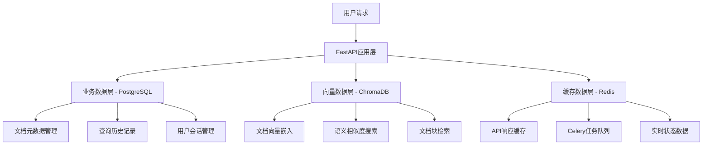

# PDF文献分析智能体 - 数据库技术选型研究

## 📋 文档概述

本文档详细分析了PDF文献分析智能体项目中数据库技术选型的考虑因素，解释了为什么选择PostgreSQL、ChromaDB、Redis这三种数据库技术的组合架构。

**项目背景**：基于AI技术的PDF文档智能分析和问答系统
**技术栈**：FastAPI + Celery + Vue.js + Docker
**数据特点**：结构化业务数据 + 非结构化文档内容 + 高维向量数据

---

## 🏗️ 整体数据架构设计

### 数据分层架构



### 设计原则

1. **职责分离** - 不同类型的数据使用最适合的存储技术
2. **性能优化** - 针对不同访问模式优化存储方案
3. **可扩展性** - 支持水平扩展和功能扩展
4. **数据一致性** - 保证关键业务数据的ACID特性
5. **运维友好** - 选择成熟稳定的技术栈

---

## 🗄️ PostgreSQL - 业务数据核心

### 选择理由

#### 1. **强大的关系数据处理能力** 💪

```sql
-- 复杂的业务查询示例
SELECT 
    d.filename,
    d.status,
    COUNT(qh.id) as query_count,
    AVG(qh.confidence) as avg_confidence,
    AVG(qh.processing_time) as avg_processing_time
FROM documents d
LEFT JOIN query_history qh ON d.id = qh.document_id
WHERE d.upload_time >= NOW() - INTERVAL '30 days'
GROUP BY d.id, d.filename, d.status
HAVING COUNT(qh.id) > 5
ORDER BY avg_confidence DESC;
```

#### 2. **原生JSON/JSONB支持** 📊

```python
# 存储复杂的文档元数据
class Document(Base):
    __tablename__ = "documents"
    
    id = Column(String, primary_key=True)
    filename = Column(String, nullable=False)
    metadata = Column(JSON, nullable=True)  # 灵活的元数据存储
    
# 查询JSON字段
documents = session.query(Document).filter(
    Document.metadata['author'].astext == '某作者'
).all()
```

#### 3. **严格的ACID事务保证** 🔒

```python
# 确保数据一致性的事务处理
async def create_document_with_history(file_info, initial_query):
    async with db.transaction():
        # 1. 创建文档记录
        document = await create_document(file_info)
        
        # 2. 记录初始查询
        await create_query_history(document.id, initial_query)
        
        # 3. 更新文档状态
        await update_document_status(document.id, "processing")
    # 要么全部成功，要么全部回滚
```

#### 4. **未来向量搜索集成能力** 🚀

```sql
-- 安装pgvector扩展，支持向量操作
CREATE EXTENSION vector;

-- 创建向量字段
ALTER TABLE document_chunks 
ADD COLUMN embedding vector(1536);

-- 向量相似度搜索
SELECT content, metadata, 
       1 - (embedding <=> $1) as similarity
FROM document_chunks 
ORDER BY embedding <=> $1 
LIMIT 10;
```

### 数据模型设计

#### 核心业务表结构

```python
class Document(Base):
    """文档基础信息表"""
    __tablename__ = "documents"
    
    id = Column(String, primary_key=True, index=True)        # 文档唯一标识
    filename = Column(String, nullable=False)                # 原始文件名
    file_path = Column(String, nullable=False)               # 服务器存储路径
    file_size = Column(Integer, nullable=False)              # 文件大小(字节)
    pages = Column(Integer, default=0)                       # PDF页数
    upload_time = Column(DateTime(timezone=True), server_default=func.now())
    status = Column(String, default="pending")               # pending/processing/completed/failed
    chunk_count = Column(Integer, default=0)                 # 文档切块数量
    metadata = Column(JSON, nullable=True)                   # 文档元数据(作者、标题等)
    error_message = Column(Text, nullable=True)              # 处理错误信息

class QueryHistory(Base):
    """查询历史记录表"""
    __tablename__ = "query_history"
    
    id = Column(Integer, primary_key=True, index=True)
    document_id = Column(String, nullable=False, index=True) # 外键关联documents.id
    question = Column(Text, nullable=False)                  # 用户原始问题
    answer = Column(Text, nullable=False)                    # AI生成回答
    confidence = Column(Float, default=0.0)                  # 回答置信度[0-1]
    processing_time = Column(Float, default=0.0)             # 处理耗时(秒)
    sources = Column(JSON, nullable=True)                    # 答案来源信息
    query_time = Column(DateTime(timezone=True), server_default=func.now())
    user_rating = Column(Integer, nullable=True)             # 用户评分1-5
```

### PostgreSQL vs MySQL 对比

| 特性对比 | PostgreSQL ✅ | MySQL ⚠️ | 项目影响 |
|----------|---------------|----------|----------|
| **JSON支持** | 原生JSONB，高性能索引 | 5.7+支持，性能一般 | 文档元数据存储优化 |
| **复杂查询** | 强大的窗口函数、CTE | 相对较弱 | 数据分析和报表生成 |
| **并发性能** | MVCC多版本并发控制 | 锁粒度较大 | 多用户同时访问 |
| **数据类型** | 丰富(数组、UUID等) | 相对有限 | 灵活的数据建模 |
| **扩展性** | pgvector、PostGIS等 | 扩展插件较少 | 未来向量搜索集成 |
| **事务隔离** | 4种隔离级别完整支持 | 部分支持 | 数据一致性保证 |
| **全文搜索** | 内置强大全文搜索 | 基础支持 | 文档内容检索 |

### 性能优化策略

#### 1. **索引优化**

```sql
-- 核心查询索引
CREATE INDEX idx_documents_status ON documents(status);
CREATE INDEX idx_documents_upload_time ON documents(upload_time);
CREATE INDEX idx_query_history_document_id ON query_history(document_id);
CREATE INDEX idx_query_history_query_time ON query_history(query_time);

-- JSON字段索引
CREATE INDEX idx_documents_metadata_author ON documents USING GIN ((metadata->>'author'));

-- 复合索引
CREATE INDEX idx_query_history_composite ON query_history(document_id, query_time DESC);
```

#### 2. **分区表设计**

```sql
-- 按时间分区查询历史表
CREATE TABLE query_history_y2024m01 PARTITION OF query_history
    FOR VALUES FROM ('2024-01-01') TO ('2024-02-01');
```

---

## 🧮 ChromaDB - 向量数据专家

### 选择理由

#### 1. **专业的向量存储和检索** 🎯

```python
# ChromaDB专门为向量操作优化
class VectorStoreManager:
    def __init__(self):
        self.client = chromadb.PersistentClient(path="./vector_db")
    
    def create_document_collection(self, document_id: str):
        """为每个文档创建独立的向量集合"""
        collection = self.client.create_collection(
            name=f"doc_{document_id}",
            metadata={"document_id": document_id}
        )
        return collection
    
    def add_document_chunks(self, document_id: str, chunks: List[Dict]):
        """添加文档块向量"""
        collection = self.client.get_collection(f"doc_{document_id}")
        
        texts = [chunk["content"] for chunk in chunks]
        embeddings = self.embedding_model.encode(texts)
        metadatas = [chunk["metadata"] for chunk in chunks]
        ids = [chunk["chunk_id"] for chunk in chunks]
        
        collection.add(
            embeddings=embeddings.tolist(),
            documents=texts,
            metadatas=metadatas,
            ids=ids
        )
```

#### 2. **高效的相似度搜索** ⚡

```python
def search_similar_chunks(self, document_id: str, query: str, k: int = 5):
    """语义相似度搜索"""
    collection = self.client.get_collection(f"doc_{document_id}")
    
    # 生成查询向量
    query_embedding = self.embedding_model.encode([query])
    
    # 执行向量搜索
    results = collection.query(
        query_embeddings=query_embedding.tolist(),
        n_results=k,
        include=['documents', 'metadatas', 'distances']
    )
    
    # 格式化结果
    formatted_results = []
    for i, doc in enumerate(results['documents'][0]):
        formatted_results.append({
            "content": doc,
            "metadata": results['metadatas'][0][i],
            "similarity_score": 1 - results['distances'][0][i],  # 转换为相似度
            "chunk_id": results['ids'][0][i]
        })
    
    return formatted_results
```

#### 3. **轻量级部署和维护** 📦

```python
# 简单的持久化配置
client = chromadb.PersistentClient(
    path="./vector_db",
    settings=Settings(
        chroma_db_impl="duckdb+parquet",
        persist_directory="./vector_db"
    )
)

# 自动数据持久化，无需复杂配置
```

#### 4. **LangChain生态集成** 🔗

```python
from langchain.vectorstores import Chroma
from langchain.embeddings import OpenAIEmbeddings

# 无缝集成LangChain
vector_store = Chroma(
    collection_name=f"doc_{document_id}",
    embedding_function=OpenAIEmbeddings(),
    client=self.client
)

# 直接支持LangChain的检索链
retriever = vector_store.as_retriever(
    search_type="similarity_score_threshold",
    search_kwargs={"score_threshold": 0.7, "k": 5}
)
```

### ChromaDB vs 其他向量数据库对比

| 对比项 | ChromaDB ✅ | Pinecone | Weaviate | Milvus |
|--------|-------------|----------|----------|---------|
| **部署复杂度** | 极简单 | 云服务 | 中等 | 复杂 |
| **LangChain集成** | 原生支持 | 支持 | 支持 | 支持 |
| **本地化部署** | 完全支持 | 仅云服务 | 支持 | 支持 |
| **学习成本** | 很低 | 低 | 中等 | 高 |
| **扩展性** | 中等 | 优秀 | 优秀 | 优秀 |
| **成本** | 免费 | 付费 | 免费/付费 | 免费 |
| **适用场景** | 中小型项目 | 大规模生产 | 企业级 | 大规模集群 |

### 数据组织结构

#### 文档向量化流程

```python
class DocumentProcessor:
    def process_document(self, file_path: str) -> Dict:
        """文档处理完整流程"""
        
        # 1. 提取文本内容
        text_content = self.extract_text_from_pdf(file_path)
        
        # 2. 文本分块
        chunks = self.split_text_into_chunks(text_content)
        
        # 3. 生成向量嵌入
        embeddings = self.generate_embeddings(chunks)
        
        # 4. 存储到ChromaDB
        self.store_vectors(document_id, chunks, embeddings)
        
        return {
            "status": "processed",
            "chunk_count": len(chunks),
            "vector_dimensions": embeddings.shape[1]
        }

    def split_text_into_chunks(self, text: str) -> List[Dict]:
        """智能文本分块"""
        from langchain.text_splitter import RecursiveCharacterTextSplitter
        
        text_splitter = RecursiveCharacterTextSplitter(
            chunk_size=1000,      # 每块最大字符数
            chunk_overlap=200,    # 块之间重叠字符数
            separators=["\n\n", "\n", "。", "！", "？", ";", "；"]
        )
        
        chunks = text_splitter.split_text(text)
        
        # 添加元数据
        formatted_chunks = []
        for i, chunk in enumerate(chunks):
            formatted_chunks.append({
                "chunk_id": f"chunk_{i}",
                "chunk_index": i,
                "content": chunk,
                "chunk_length": len(chunk),
                "metadata": {
                    "source": "pdf_extraction",
                    "chunk_type": "text"
                }
            })
        
        return formatted_chunks
```

---

## ⚡ Redis - 高性能缓存层

### 选择理由

#### 1. **Celery任务队列支持** 🔄

```python
# Redis作为Celery的Broker和Backend
from celery import Celery

celery_app = Celery(
    "document_analysis",
    broker="redis://redis:6379/0",      # 任务队列
    backend="redis://redis:6379/0"      # 结果存储
)

# 异步文档处理任务
@celery_app.task(bind=True)
def process_document_task(self, document_id: str, file_path: str):
    try:
        # 更新任务进度
        self.update_state(
            state="PROCESSING",
            meta={"step": "extracting_text", "progress": 20}
        )
        
        # 执行文档处理
        result = document_processor.process_document(file_path)
        
        # 更新进度
        self.update_state(
            state="PROCESSING", 
            meta={"step": "creating_vectors", "progress": 60}
        )
        
        # 创建向量存储
        vector_store_path = vector_store_manager.create_vector_store(
            document_id, result["chunks"]
        )
        
        return {
            "status": "completed",
            "progress": 100,
            "vector_store_path": vector_store_path
        }
        
    except Exception as e:
        self.update_state(
            state="FAILURE",
            meta={"error": str(e), "progress": 0}
        )
        raise
```

#### 2. **API响应缓存** 📈

```python
class CacheManager:
    def __init__(self, redis_client):
        self.redis = redis_client
        self.default_expire = 3600  # 1小时
    
    def search_cache_key(self, document_id: str, query: str, k: int) -> str:
        """生成搜索缓存键"""
        import hashlib
        query_hash = hashlib.md5(query.encode()).hexdigest()
        return f"search:{document_id}:{query_hash}:{k}"
    
    async def cached_search(self, document_id: str, query: str, k: int):
        """带缓存的向量搜索"""
        cache_key = self.search_cache_key(document_id, query, k)
        
        # 检查缓存
        cached_result = await self.redis.get(cache_key)
        if cached_result:
            return json.loads(cached_result)
        
        # 执行搜索
        results = await self.vector_store.search_similar_chunks(
            document_id, query, k
        )
        
        # 缓存结果
        await self.redis.setex(
            cache_key, 
            self.default_expire, 
            json.dumps(results)
        )
        
        return results
```

#### 3. **实时状态管理** 📊

```python
class StatusManager:
    def __init__(self, redis_client):
        self.redis = redis_client
    
    async def update_document_status(self, document_id: str, status: dict):
        """更新文档处理状态"""
        await self.redis.setex(
            f"status:{document_id}",
            300,  # 5分钟过期
            json.dumps(status)
        )
    
    async def get_document_status(self, document_id: str) -> dict:
        """获取文档处理状态"""
        status_data = await self.redis.get(f"status:{document_id}")
        if status_data:
            return json.loads(status_data)
        return {"status": "unknown"}
    
    async def set_user_session(self, session_id: str, user_data: dict):
        """用户会话管理"""
        await self.redis.setex(
            f"session:{session_id}",
            86400,  # 24小时
            json.dumps(user_data)
        )
```

#### 4. **分布式锁和限流** 🔒

```python
class RedisLockManager:
    def __init__(self, redis_client):
        self.redis = redis_client
    
    async def acquire_document_lock(self, document_id: str, timeout: int = 30):
        """获取文档处理锁，防止重复处理"""
        lock_key = f"lock:document:{document_id}"
        
        # 尝试获取锁
        lock_acquired = await self.redis.set(
            lock_key, 
            "locked", 
            nx=True,  # 只在键不存在时设置
            ex=timeout  # 过期时间
        )
        
        return lock_acquired
    
    async def release_document_lock(self, document_id: str):
        """释放文档处理锁"""
        lock_key = f"lock:document:{document_id}"
        await self.redis.delete(lock_key)

class RateLimiter:
    def __init__(self, redis_client):
        self.redis = redis_client
    
    async def check_rate_limit(self, user_id: str, limit: int = 100, window: int = 3600):
        """检查用户API调用频率限制"""
        key = f"rate_limit:{user_id}"
        
        # 使用Redis计数器
        current_count = await self.redis.incr(key)
        
        if current_count == 1:
            # 第一次调用，设置过期时间
            await self.redis.expire(key, window)
        
        return current_count <= limit
```

### Redis vs 其他缓存方案对比

| 对比项 | Redis ✅ | Memcached | 应用内缓存 | 数据库缓存 |
|--------|----------|-----------|------------|------------|
| **数据类型** | 丰富(字符串、列表、集合等) | 仅字符串 | 取决于实现 | 有限 |
| **持久化** | 支持RDB和AOF | 不支持 | 应用重启丢失 | 依赖数据库 |
| **分布式** | 原生支持集群 | 客户端分片 | 困难 | 复杂 |
| **任务队列** | 完美支持 | 不支持 | 需要额外实现 | 性能差 |
| **事务支持** | 支持 | 不支持 | 取决于实现 | 支持 |
| **Lua脚本** | 支持 | 不支持 | N/A | 部分支持 |
| **运维成熟度** | 非常成熟 | 成熟 | 应用绑定 | 复杂 |

---

## 🔄 三数据库协同工作流程

### 典型业务流程

#### 1. **文档上传和处理**

```python
async def upload_and_process_document(file: UploadFile):
    """文档上传处理完整流程"""
    
    # 1. PostgreSQL: 创建文档记录
    document_id = str(uuid.uuid4())
    db_document = Document(
        id=document_id,
        filename=file.filename,
        file_path=f"uploads/{document_id}_{file.filename}",
        file_size=len(await file.read()),
        status="pending"
    )
    
    async with database.transaction():
        await database.execute(documents.insert().values(**db_document.dict()))
    
    # 2. Redis: 提交异步处理任务
    task = process_document_task.delay(document_id, db_document.file_path)
    
    # 3. Redis: 缓存任务状态
    await redis_client.setex(
        f"task:{task.id}",
        3600,
        json.dumps({"document_id": document_id, "status": "pending"})
    )
    
    return {
        "document_id": document_id,
        "task_id": task.id,
        "status": "pending"
    }

async def process_document_background(document_id: str, file_path: str):
    """后台文档处理"""
    
    try:
        # 1. Redis: 更新处理状态
        await redis_client.setex(
            f"status:{document_id}",
            300,
            json.dumps({"status": "processing", "step": "text_extraction"})
        )
        
        # 2. 处理文档内容
        processor = DocumentProcessor()
        result = processor.process_document(file_path)
        
        # 3. ChromaDB: 存储向量数据
        vector_manager = VectorStoreManager()
        await vector_manager.create_document_collection(document_id)
        await vector_manager.add_document_chunks(document_id, result["chunks"])
        
        # 4. PostgreSQL: 更新文档状态
        await database.execute(
            documents.update()
            .where(documents.c.id == document_id)
            .values(
                status="completed",
                chunk_count=len(result["chunks"]),
                metadata=result["metadata"]
            )
        )
        
        # 5. Redis: 清理临时状态
        await redis_client.delete(f"status:{document_id}")
        
    except Exception as e:
        # 错误处理
        await database.execute(
            documents.update()
            .where(documents.c.id == document_id)
            .values(status="failed", error_message=str(e))
        )
```

#### 2. **智能问答查询**

```python
async def answer_question(document_id: str, question: str):
    """智能问答完整流程"""
    
    # 1. PostgreSQL: 验证文档状态
    document = await database.fetch_one(
        documents.select().where(documents.c.id == document_id)
    )
    
    if not document or document.status != "completed":
        raise HTTPException(404, "文档未找到或处理未完成")
    
    # 2. Redis: 检查查询缓存
    cache_key = f"query:{document_id}:{hashlib.md5(question.encode()).hexdigest()}"
    cached_result = await redis_client.get(cache_key)
    
    if cached_result:
        # 缓存命中，直接返回
        result = json.loads(cached_result)
        
        # PostgreSQL: 记录查询历史（缓存命中）
        await database.execute(
            query_history.insert().values(
                document_id=document_id,
                question=question,
                answer=result["answer"],
                confidence=result["confidence"],
                processing_time=0.001,  # 缓存响应极快
                sources=result["sources"]
            )
        )
        
        return result
    
    # 3. ChromaDB: 向量相似度搜索
    start_time = time.time()
    
    vector_manager = VectorStoreManager()
    search_results = await vector_manager.search_similar_chunks(
        document_id=document_id,
        query=question,
        k=5
    )
    
    # 4. AI模型: 生成回答
    agent = DocumentAnalysisAgent()
    answer_result = await agent.answer_question(
        document_id=document_id,
        question=question,
        search_results=search_results
    )
    
    processing_time = time.time() - start_time
    
    # 5. PostgreSQL: 保存查询历史
    await database.execute(
        query_history.insert().values(
            document_id=document_id,
            question=question,
            answer=answer_result["answer"],
            confidence=answer_result["confidence"],
            processing_time=processing_time,
            sources=answer_result["sources"]
        )
    )
    
    # 6. Redis: 缓存查询结果
    await redis_client.setex(
        cache_key,
        3600,  # 1小时缓存
        json.dumps(answer_result)
    )
    
    return answer_result
```

### 数据一致性保证

#### 1. **事务边界设计**

```python
class DataConsistencyManager:
    def __init__(self, postgres_db, chroma_client, redis_client):
        self.postgres = postgres_db
        self.chroma = chroma_client
        self.redis = redis_client
    
    async def safe_document_deletion(self, document_id: str):
        """安全删除文档（保证数据一致性）"""
        
        try:
            # 1. PostgreSQL事务开始
            async with self.postgres.transaction():
                # 获取文档信息
                document = await self.postgres.fetch_one(
                    documents.select().where(documents.c.id == document_id)
                )
                
                if not document:
                    raise ValueError("文档不存在")
                
                # 删除相关的查询历史
                await self.postgres.execute(
                    query_history.delete().where(
                        query_history.c.document_id == document_id
                    )
                )
                
                # 删除文档记录
                await self.postgres.execute(
                    documents.delete().where(documents.c.id == document_id)
                )
                
                # PostgreSQL事务提交点
            
            # 2. ChromaDB: 删除向量数据
            try:
                collection_name = f"doc_{document_id}"
                self.chroma.delete_collection(name=collection_name)
            except Exception as e:
                logger.warning(f"ChromaDB删除失败，但不影响业务: {e}")
            
            # 3. Redis: 清理相关缓存
            cache_keys = await self.redis.keys(f"*{document_id}*")
            if cache_keys:
                await self.redis.delete(*cache_keys)
            
            # 4. 文件系统: 删除文件
            if document.file_path and os.path.exists(document.file_path):
                os.remove(document.file_path)
            
            return {"status": "success", "message": "文档删除成功"}
            
        except Exception as e:
            # 如果PostgreSQL事务失败，整个操作都会回滚
            logger.error(f"文档删除失败: {e}")
            raise
```

#### 2. **数据同步策略**

```python
class DataSyncManager:
    """数据同步管理器"""
    
    async def sync_document_status(self, document_id: str):
        """同步文档状态到各个存储"""
        
        # 从PostgreSQL获取权威状态
        document = await self.postgres.fetch_one(
            documents.select().where(documents.c.id == document_id)
        )
        
        if not document:
            return
        
        # 同步到Redis缓存
        await self.redis.setex(
            f"doc_status:{document_id}",
            3600,
            json.dumps({
                "status": document.status,
                "chunk_count": document.chunk_count,
                "last_updated": document.updated_at.isoformat()
            })
        )
        
        # 验证ChromaDB数据一致性
        if document.status == "completed":
            try:
                collection = self.chroma.get_collection(f"doc_{document_id}")
                actual_count = collection.count()
                
                if actual_count != document.chunk_count:
                    logger.warning(
                        f"数据不一致: PostgreSQL显示{document.chunk_count}块，"
                        f"但ChromaDB有{actual_count}块"
                    )
                    
                    # 触发数据修复
                    await self.trigger_data_repair(document_id)
                    
            except Exception as e:
                logger.error(f"ChromaDB一致性检查失败: {e}")
    
    async def trigger_data_repair(self, document_id: str):
        """触发数据修复任务"""
        repair_task.delay(document_id)
```

---

## 📊 性能优化策略

### 1. **查询性能优化**

#### PostgreSQL优化

```sql
-- 创建覆盖索引
CREATE INDEX idx_query_history_performance 
ON query_history(document_id, query_time DESC) 
INCLUDE (question, confidence, processing_time);

-- 分区表优化大数据量
CREATE TABLE query_history_partitioned (
    LIKE query_history INCLUDING ALL
) PARTITION BY RANGE (query_time);

-- 物化视图加速统计查询
CREATE MATERIALIZED VIEW document_stats AS
SELECT 
    d.id,
    d.filename,
    d.status,
    COUNT(qh.id) as total_queries,
    AVG(qh.confidence) as avg_confidence,
    AVG(qh.processing_time) as avg_processing_time,
    MAX(qh.query_time) as last_query_time
FROM documents d
LEFT JOIN query_history qh ON d.id = qh.document_id
GROUP BY d.id, d.filename, d.status;

-- 定期刷新物化视图
REFRESH MATERIALIZED VIEW CONCURRENTLY document_stats;
```

#### ChromaDB优化

```python
# 批量操作优化
class OptimizedVectorStore:
    def __init__(self):
        self.batch_size = 100
        self.client = chromadb.PersistentClient(
            path="./vector_db",
            settings=Settings(
                # 优化设置
                chroma_db_impl="duckdb+parquet",
                persist_directory="./vector_db",
                anonymized_telemetry=False
            )
        )
    
    async def batch_add_chunks(self, document_id: str, chunks: List[Dict]):
        """批量添加文档块"""
        collection = self.client.get_collection(f"doc_{document_id}")
        
        # 分批处理
        for i in range(0, len(chunks), self.batch_size):
            batch = chunks[i:i + self.batch_size]
            
            texts = [chunk["content"] for chunk in batch]
            embeddings = await self.embedding_model.aencode(texts)
            metadatas = [chunk["metadata"] for chunk in batch]
            ids = [chunk["chunk_id"] for chunk in batch]
            
            collection.add(
                embeddings=embeddings.tolist(),
                documents=texts,
                metadatas=metadatas,
                ids=ids
            )
```

#### Redis优化

```python
# 连接池和管道优化
class OptimizedRedisManager:
    def __init__(self):
        self.pool = redis.ConnectionPool(
            host='redis',
            port=6379,
            db=0,
            max_connections=20,
            decode_responses=True
        )
        self.redis = redis.Redis(connection_pool=self.pool)
    
    async def batch_cache_operations(self, operations: List[tuple]):
        """批量缓存操作"""
        pipe = self.redis.pipeline()
        
        for op_type, key, value, expire in operations:
            if op_type == "set":
                pipe.setex(key, expire, json.dumps(value))
            elif op_type == "get":
                pipe.get(key)
        
        results = pipe.execute()
        return results
    
    async def smart_cache_strategy(self, key: str, value: any, 
                                 access_pattern: str = "normal"):
        """智能缓存策略"""
        if access_pattern == "hot":
            expire = 3600 * 6  # 6小时
        elif access_pattern == "warm": 
            expire = 3600 * 2  # 2小时
        else:
            expire = 3600      # 1小时
        
        await self.redis.setex(key, expire, json.dumps(value))
```

### 2. **内存使用优化**

```python
class MemoryOptimizedSystem:
    def __init__(self):
        self.max_cache_size = 1000  # 最大缓存条目数
        self.cleanup_threshold = 0.8  # 清理阈值
    
    async def memory_aware_caching(self, key: str, value: any):
        """内存感知的缓存策略"""
        current_memory = psutil.virtual_memory().percent
        
        if current_memory > 80:
            # 内存紧张，使用较短的过期时间
            expire = 300  # 5分钟
        elif current_memory > 60:
            # 内存适中
            expire = 1800  # 30分钟
        else:
            # 内存充足
            expire = 3600  # 1小时
        
        await self.redis.setex(key, expire, json.dumps(value))
    
    async def cleanup_expired_data(self):
        """清理过期数据"""
        # 清理PostgreSQL中的旧查询记录
        await self.postgres.execute("""
            DELETE FROM query_history 
            WHERE query_time < NOW() - INTERVAL '30 days'
        """)
        
        # 清理Redis过期键
        await self.redis.execute_command("MEMORY", "PURGE")
```

---

## 🔧 运维和监控

### 1. **健康检查**

```python
class HealthCheckManager:
    async def check_all_services(self) -> Dict[str, str]:
        """检查所有数据库服务健康状态"""
        results = {}
        
        # PostgreSQL健康检查
        try:
            await self.postgres.fetch_one("SELECT 1")
            results["postgresql"] = "healthy"
        except Exception as e:
            results["postgresql"] = f"unhealthy: {str(e)}"
        
        # ChromaDB健康检查
        try:
            collections = self.chroma.list_collections()
            results["chromadb"] = f"healthy ({len(collections)} collections)"
        except Exception as e:
            results["chromadb"] = f"unhealthy: {str(e)}"
        
        # Redis健康检查
        try:
            await self.redis.ping()
            info = await self.redis.info()
            results["redis"] = f"healthy (memory: {info['used_memory_human']})"
        except Exception as e:
            results["redis"] = f"unhealthy: {str(e)}"
        
        return results
```

### 2. **性能监控**

```python
class PerformanceMonitor:
    def __init__(self):
        self.metrics = {}
    
    async def collect_metrics(self):
        """收集性能指标"""
        
        # PostgreSQL指标
        pg_stats = await self.postgres.fetch_one("""
            SELECT 
                (SELECT count(*) FROM documents) as total_documents,
                (SELECT count(*) FROM query_history) as total_queries,
                (SELECT avg(processing_time) FROM query_history 
                 WHERE query_time > NOW() - INTERVAL '1 hour') as avg_processing_time
        """)
        
        # Redis指标
        redis_info = await self.redis.info()
        
        # ChromaDB指标
        collections = self.chroma.list_collections()
        total_vectors = sum(col.count() for col in collections)
        
        metrics = {
            "postgresql": {
                "total_documents": pg_stats["total_documents"],
                "total_queries": pg_stats["total_queries"],
                "avg_processing_time": float(pg_stats["avg_processing_time"] or 0)
            },
            "redis": {
                "memory_usage": redis_info["used_memory"],
                "connected_clients": redis_info["connected_clients"],
                "keyspace_hits": redis_info["keyspace_hits"],
                "keyspace_misses": redis_info["keyspace_misses"]
            },
            "chromadb": {
                "total_collections": len(collections),
                "total_vectors": total_vectors
            }
        }
        
        # 存储到时序数据库或日志
        await self.store_metrics(metrics)
        
        return metrics
```

### 3. **备份策略**

```bash
#!/bin/bash
# 数据备份脚本

# PostgreSQL备份
pg_dump -h postgres -U postgres document_analysis > /backup/postgres_$(date +%Y%m%d_%H%M%S).sql

# Redis备份
redis-cli --rdb /backup/redis_$(date +%Y%m%d_%H%M%S).rdb

# ChromaDB备份
tar -czf /backup/chromadb_$(date +%Y%m%d_%H%M%S).tar.gz ./vector_db/

# 上传文件备份
tar -czf /backup/uploads_$(date +%Y%m%d_%H%M%S).tar.gz ./uploads/

# 清理7天前的备份
find /backup -name "*.sql" -mtime +7 -delete
find /backup -name "*.rdb" -mtime +7 -delete
find /backup -name "*.tar.gz" -mtime +7 -delete
```

---

## 🚀 未来演进路线

### 1. **短期优化（1-3个月）**

- **PostgreSQL pgvector集成**：逐步将向量搜索迁移到PostgreSQL
- **Redis Cluster部署**：支持水平扩展和高可用
- **监控仪表板**：Grafana + Prometheus监控大盘

### 2. **中期扩展（3-6个月）**

- **读写分离**：PostgreSQL主从架构
- **缓存策略优化**：多级缓存体系
- **分布式向量搜索**：支持更大规模文档库

### 3. **长期规划（6-12个月）**

- **多模态支持**：图片、表格向量化
- **知识图谱集成**：Neo4j存储实体关系
- **实时数据流**：Kafka + ClickHouse分析

---

## 📋 总结

### 技术选型决策总结

| 数据库 | 主要职责 | 选择理由 | 替代方案对比 |
|--------|----------|----------|-------------|
| **PostgreSQL** | 业务数据管理 | ACID事务、JSON支持、未来pgvector集成 | MySQL性能略逊，功能不够丰富 |
| **ChromaDB** | 向量存储检索 | LangChain集成、部署简单、学习成本低 | Pinecone太贵，Milvus太复杂 |
| **Redis** | 缓存和队列 | Celery支持、高性能、生态成熟 | Memcached功能有限，RabbitMQ学习成本高 |

### 架构优势

1. **职责清晰**：每种数据库专注于自己擅长的领域
2. **性能优化**：针对不同访问模式优化存储策略
3. **可扩展性**：支持水平扩展和功能扩展
4. **运维友好**：成熟的工具链和最佳实践
5. **成本可控**：开源方案，避免供应商锁定

### 关键成功因素

1. **数据一致性**：通过事务和补偿机制保证
2. **性能监控**：实时监控和预警机制
3. **故障恢复**：完善的备份和恢复策略
4. **团队能力**：技术栈符合团队技能水平


这种三数据库协同的架构设计，既满足了当前的业务需求，又为未来的功能扩展预留了充足的空间，是一个经过深思熟虑的技术选型决策。
